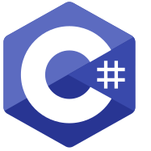

  <h1 align="center">
    
</h1>
  
<em>Backend developer who enjoys building systems and understanding how things work under the hood.</em>

  
From Bhaktapur, Nepal. Currently based in India.

  I work primarily with <strong>Java</strong> and <strong>JavaScript</strong>, building backend services, APIs, and distributed systems.

  I'm currently a Software Engineering Intern at <strong>Optmyzr</strong>, where I build features for the Amazon Ads platform
  across a full-stack C#/.NET and React codebase. Previously, at <strong>Lowe's India</strong>, I worked on enterprise-scale
  backend systems, developer tools, and production services — which gave me practical exposure to how real-world software
  is built and maintained.

---

  <h3>Technical Skills</h3>

  <b>LANGUAGES</b>

  &nbsp;&nbsp;
  &nbsp;&nbsp;
  &nbsp;&nbsp;
  &nbsp;&nbsp;
  &nbsp;&nbsp;
  

  <b>BACKEND</b>

  &nbsp;&nbsp;
  &nbsp;&nbsp;
  &nbsp;&nbsp;
  &nbsp;&nbsp;
  

  <b>FRONTEND</b>

  &nbsp;&nbsp;
  &nbsp;&nbsp;
  

  <b>DATABASES</b>

  &nbsp;&nbsp;
  &nbsp;&nbsp;
  &nbsp;&nbsp;
  &nbsp;&nbsp;
  &nbsp;&nbsp;
  

  <b>TOOLS &amp; INFRA</b>

  &nbsp;&nbsp;
  &nbsp;&nbsp;
  &nbsp;&nbsp;
  

---

  <h3>GitHub Stats</h3>
  

---

  
   
  <a href="https://sujshrest.dev" target="_blank"><strong>Visit my portfolio</strong></a>

